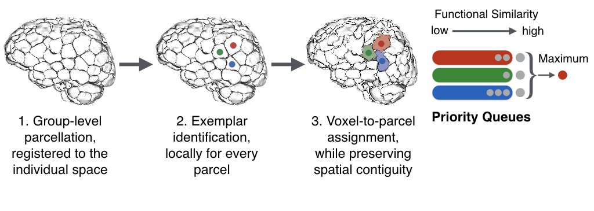

# Node-Parcellation

<p align="center">
	
</p>

This is the documentation file for **spatially-constrained exemplar-based node parcellation** of the human brain at the individual- and state-specific level. For more details, please see Salehi et al., 2017 [1] and Salehi et al., 2018 [2].

The parcellation algorithm is implemented in C++, and is part of the open-source BioImage Suite Project. To run these files, you need to download BioImageSuite source code from [here](https://www.nitrc.org/projects/bioimagesuite). After downloading BioImage Suite source code (under the name "bioimagesuite32_0b1_src"), you can run the individualized parcellation algorithm via the following:

1. Move the file 'vtkbisIndividualizeParcellation.cpp' to '/bioimagesuite32_0b1_src/Connectivity/'

2. Move the file 'bis_individualizeconnectivity.tcl' to '/bioimagesuite32_0b1_src/bioimagesuite/bis_algorithm/'

3. Build the package following the steps in the BioImageSuite mannual (see [here](http://bioimagesuite.yale.edu/manual/index.aspx))

4. Make sure you set the environment path, by running the following command:
```bash
source bioimagesuite32_0b1_src/build/setpaths.csh
```
5. Execute the the individualzied parcellation algorithm using the following command:
``` bash
bis_individualizeconnectivity.tcl -inp $input -inp2 $parc  -indiv_group 1 -blursigma $BW -num_exemplar $K
```

- **$input** is the .nii file containing the voxel-level time series.

- **$parc** is the initial group-level parcellation that the algorihtm starts from. Please refer to the manuscript for more details.

- **indiv_group** option should be set to **1** to generate individualized parcellations, as well as the functional connectivity matrices using the individualize partcellations. If set to **0**, it will only output the functional connectivity matrices, using initial group-level parcellation.

- **$BW** is the smoothing kernel's bandwidth. In the original work, we set **BW=4**.

- **$K** is the number of nodes in the parcellation. **K** should match the group-level parcellation. Here we used the parcelation by Shen et al. [3], where **K=268** for whole brain analysis, and **K=188** for cortical analysis.

For further questions please raise an issue [here](https://github.com/YaleMRRC/Node-Parcellation/issues).


### References

[1] Salehi, M., Karbasi, A., Scheinost, D., & Constable, R. T. (2017, September). A submodular approach to create individualized parcellations of the human brain. In International Conference on Medical Image Computing and Computer-Assisted Intervention (pp. 478-485). Springer, Cham.

[2] Salehi, M., Greene, A. S., Karbasi, A., Shen, X., Scheinost, D., & Constable, R. T. (2018). There is no single functional atlas even for a single individual: Parcellation of the human brain is state dependent. bioRxiv, 431833.

[3] Shen, X., Tokoglu, F., Papademetris, X., & Constable, R. T. (2013). Groupwise whole-brain parcellation from resting-state fMRI data for network node identification. Neuroimage, 82, 403-415.

